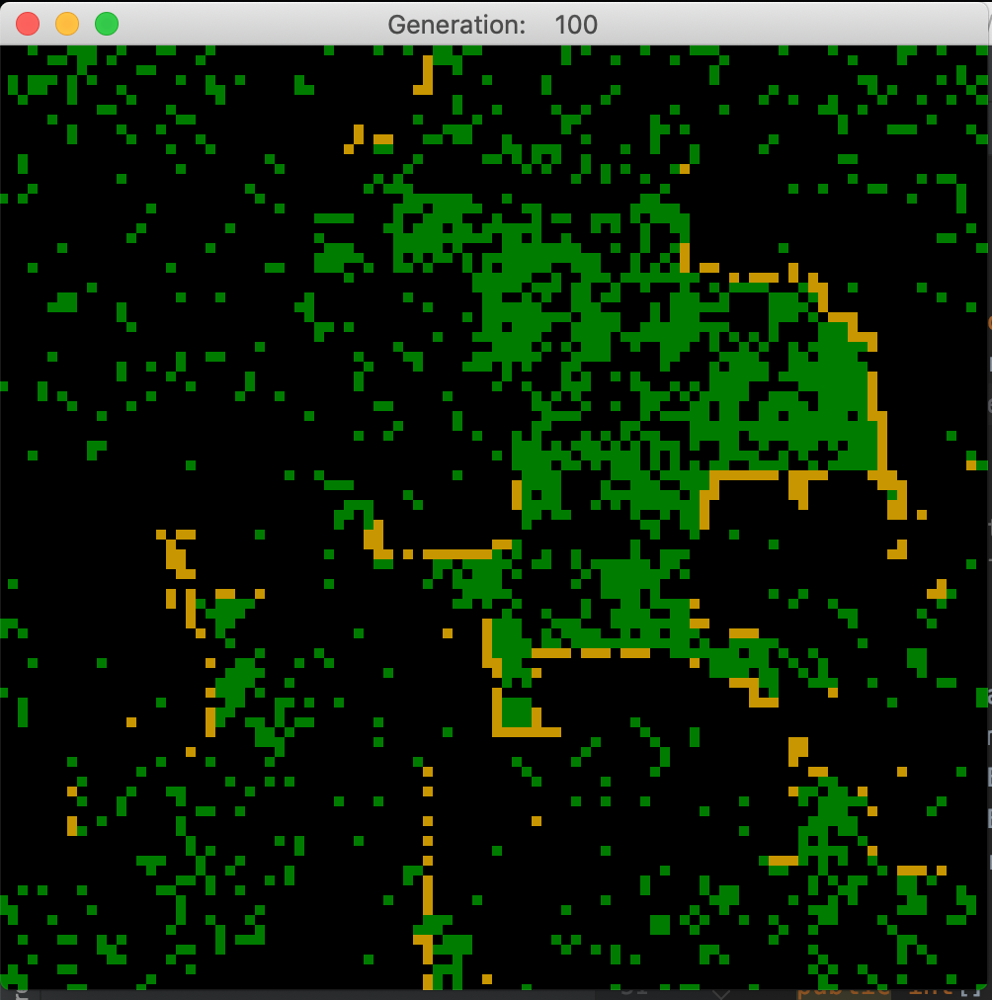

This is a cellular automaton to simulate forest fires. Forked from (https://github.com/deltaGPhys/ConwayGameOfLife) -> (https://github.com/Zipcoder/ConwayGameOfLife)

### Rules

Each cell can be empty (black), occupied by a tree (green) or burning (orange).

(These four rules are from the model created by Drossel and Schwabl (1992))
* A tree will catch fire if any neighboring cell is on fire
* A burning tree cell will become empty
* An empty cell will grow a tree with probability *t*
* A tree will catch fire with probability *f* (even if it's not near a burning tree; this simulates lightning strikes)

So that fire does not burn constantly, *t* >> *f*, and the time for a large clump to burn through is significantly 
greater than the expectation value for a tree to grow adjacent to the fire.

An additional rule is used here to encourage a clumping behavior in the trees: the probability of a tree growing 
in an empty cell is *t*(numNeighbors+1).

