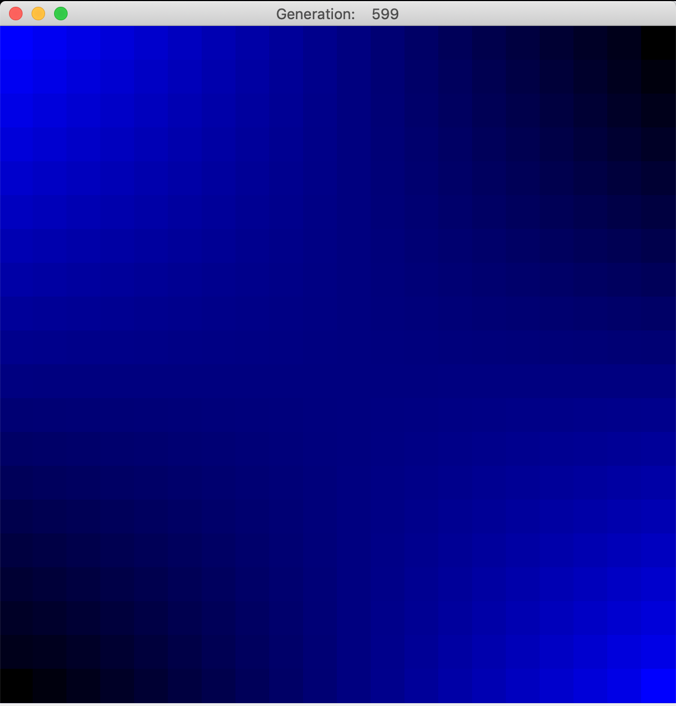
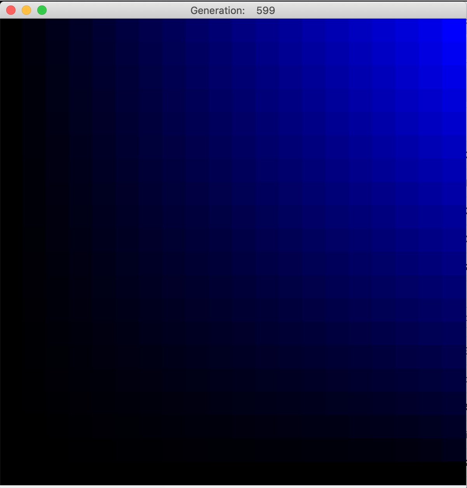

This is a relaxation-method solver for [Laplace's equation](https://en.wikipedia.org/wiki/Laplace%27s_equation). 
Forked from (https://github.com/deltaGPhys/ForestFire) -> (https://github.com/deltaGPhys/ConwayGameOfLife) -> (https://github.com/Zipcoder/ConwayGameOfLife)

### Background
Laplace's equation requires that the divergence of the gradient is locally always zero, which has the effect that there 
can be no local maxima or minima in the interior of the region. The boundary values are fixed, and interior values (or a function
for interior values) need to be found to satisfy Laplace's equation.

### Solving the Equation
Finding such a function analytically for any but the simplest cases is often impossible, so numerical methods are used. 
One such method is called *relaxation*. The discrete analogy to Laplace's equation is a condition that each interior cell's
value is the average of its neighbors' values. While it's easy to find those averages, doing so changes the values of the neighbors,
changing the average, and on and on. Eventually, applying this technique sequentially through many generations causes the interior
state to "relax" to a steady state.

### Applications
This is useful to determine the electric potential (or any potential) and in fluid flows, given boundary conditions. An 
easier-to-visualize application comes from heat transfer, though. Imagining that the boundaries of a piece of material, like
a cooling vane on a heat sink, are held fixed (one end on the processor, one end in the air, etc.), the steady-state temperature 
distribution can be determined via this method.

### Execution
The engine take values for the four corners of the region and creates linear gradients on each of the four edges, then loops through 
successive implementations of the algorithm, setting each cell's next value as the average of its neighbors' values, and scaling the
color intensity accordingly. Over time, the solution relaxes to a steady state that fulfills the discrete Laplace equation. This can 
take many generations in some cases. Notice that local maxima and minima do not occur in the interior (though saddle points are allowed).

